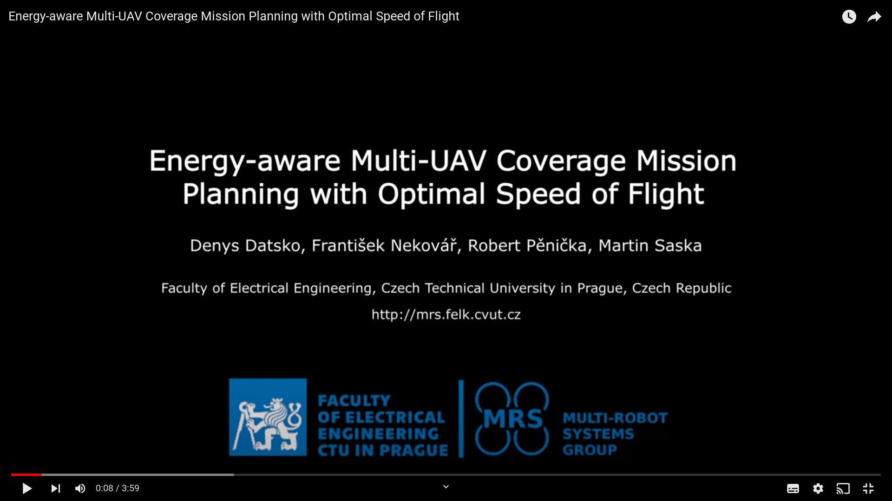

# Energy-aware Multi-UAV Coverage Mission Planning with Optimal Speed of Flight
This repository contains the code for **Energy-aware Multi-UAV Coverage Mission Planning with Optimal Speed of Flight** presented in our paper [Datsko, Nekovar, Penicka, Saska](https://ieeexplore.ieee.org/document/10414185).
[](https://youtu.be/S8kjqZp-G-0)

## Citing
If you use this code in an academic context, please cite the following publication:

D. Datsko, F. Nekovar, R. Penicka and M. Saska, "Energy-aware Multi-UAV Coverage Mission Planning with Optimal Speed of Flight," in IEEE Robotics and Automation Letters, doi: 10.1109/LRA.2024.3358581. ([PDF](https://ieeexplore.ieee.org/document/10414185))

```bash
@ARTICLE{Datsko2024EAmcpp,
  author={Datsko, Denys and Nekovar, Frantisek and Penicka, Robert and Saska, Martin},
  journal={IEEE Robotics and Automation Letters}, 
  title={Energy-aware Multi-UAV Coverage Mission Planning with Optimal Speed of Flight}, 
  year={2024},
  volume={},
  number={},
  pages={1-8},
  keywords={Energy consumption;Autonomous aerial vehicles;Planning;Trajectory;Estimation;Batteries;Traveling salesman problems;Aerial Systems: Applications;Path Planning for Multiple Mobile Robots or Agents;Planning, Scheduling and Coordination},
  doi={10.1109/LRA.2024.3358581}}
```


## License
GPL-3.0 License. Copyright (C) 2022 D. Datsko, F. Nekovář, R. Pěnička, M. Saska (Faculty of Electrical Engineering, Czech Technical University in Prague).

This is a research code, expect that it changes often and any fitness for a particular purpose is disclaimed.

## Installation and usage
The code has been developed and tested on Ubuntu 20.04.

### Downloading the code
Clone the repository and update the submodules

`git clone https://github.com/ctu-mrs/EnergyAwareMCPP.git`

`cd EnergyAwareMCPP/`

### Compilation and dependencies
Install the following dependencies

`sudo apt-get install build-essential cmake pkg-config`

and compile in the build directory using cmake

```bash
mkdir build
cd build
cmake ..
make
```

### Running the code
After compilation you should see the coverage_mission_planner binary in the main directory. The prepared configuration files for existing maps are stored in the `sample_configs` directory, where you can find configurations similar to show we used in the paper. You can run the code from any of the subdirectories with configs using:
`../../build/coverage_mission_planner sample_algorithm_config.yaml`
The output of the run is saved in `path_*.csv` files where * is the number of the generated path.

All the sample configuration files contain sufficient comments, so you can copy any of them and modify according to your needs.
In the configuration file, you should provide all the algorithm parameters and list the names of `.csv` files containing polygons describing fly zones and no-fly zones.
These files may contain points either (latitude, longitude) format or (x, y) in meters, and the output paths will be in the same format as the input


### After (and before) running the code, you can visualize the Area of Interest together with generated paths
For this, from the direcotry with the experiment, run the provided python script: `python ../../scripts/visualize_paths.py ./config.yaml` if no paths were generated yet, or `python ../../scripts/visualize_paths.py ./config.yaml path*` to visualize the produced paths.


### Limitations
It is important to mention that the current implementation does not support inputs where any two polygon edges intersect.
This means that all the no-fly-zones should be fully inside of the fly-zone and may not overlap with each other
>>>>>>> dev
